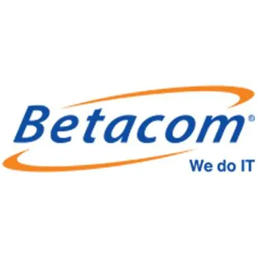

# Progetto Ciclilavarizia

**Sede Betacom di Treviso**
<p align="left">
  
</p>
Team:

* Gabriel Goxhaj
* Karlo Kasi
* Matteo Santi
* Giacomo Di Bert
* Loris Vieriu
* Giovanni Greggio

## Descrizione del progetto

Ciclilavarizia è un progetto finale realizzato al termine del corso di sviluppo software .NET erogato da Betacom. L'obiettivo del progetto è la realizzazione di un **e-commerce dedicato alla vendita di biciclette**, completo di funzionalità di gestione prodotti, utenti e ordini.

Il sistema è composto da:

* **Backend**: API REST sviluppata in C# con **ASP.NET Core**
* **Frontend**: applicazione web realizzata in **Angular**

## Funzionalità previste

* ✅ Gestione catalogo biciclette (CRUD)
* ✅ Gestione utenti e autenticazione
* ✅ Carrello acquisti
* ✅ Gestione ordini
* ✅ Sistema ruoli (utente / admin)

## Tecnologie utilizzate

### Backend

* C# / .NET 8
* ASP.NET Core Web API
* Entity Framework Core
* SQL Server

### Frontend

* Angular
* Angular Material / Bootstrap (se applicato)
* TypeScript

## Struttura del progetto

```
Ciclilavarizia/
├── backend/        # API ASP.NET Core
└── frontend/       # Applicazione Angular
```

## Requisiti per l'esecuzione

* .NET SDK 8+
* Node.js 18+
* SQL Server

## Come eseguire

### Backend

```bash
cd backend
 dotnet restore
 dotnet run
```

### Frontend

```bash
cd frontend
npm install
ng serve -o
```

## Obiettivo formativo

Il progetto ha lo scopo di consolidare le competenze acquisite durante il percorso formativo, in particolare:

* Sviluppo backend con ASP.NET Core
* Web development frontend con Angular
* Gestione database e ORM (EF Core)
* Integrazione API REST
* Lavoro in team e versionamento con Git

## Stato del progetto

🚧 *In sviluppo* — progetto in fase di completamento finale.

## Licenza

Progetto didattico interno Betacom — non destinato alla distribuzione commerciale.
